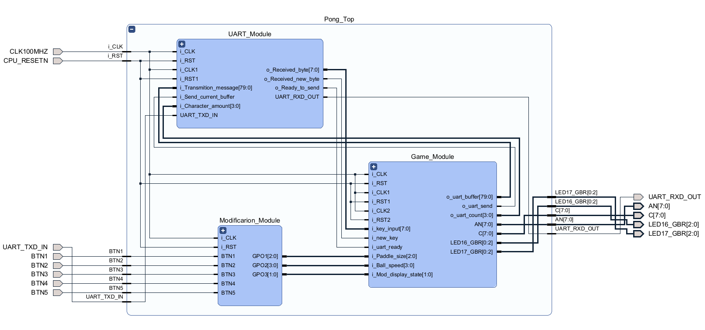
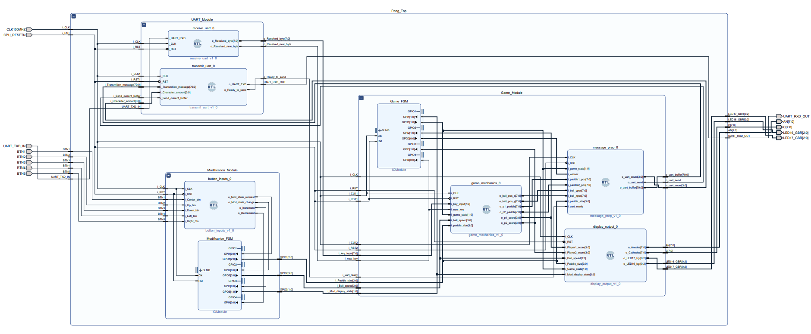
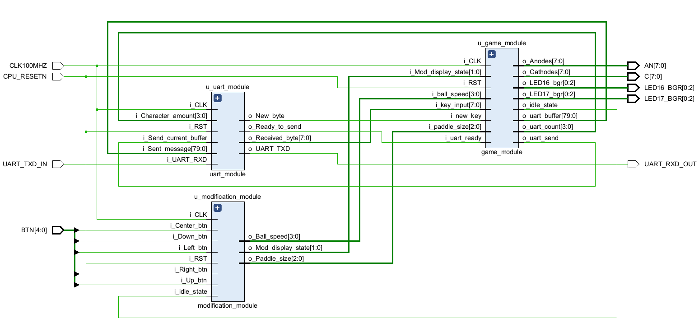
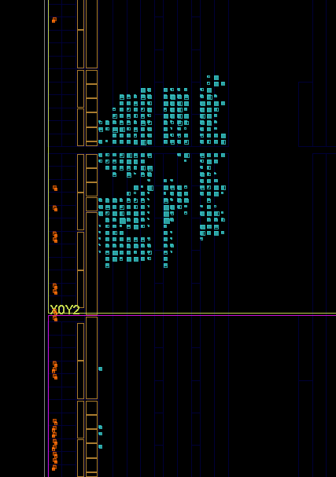
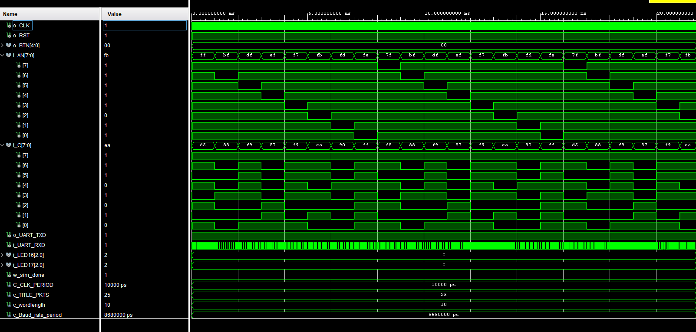
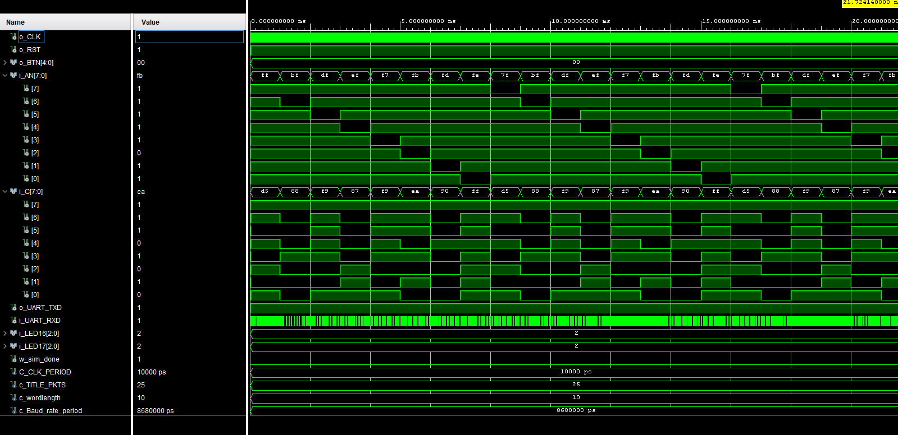
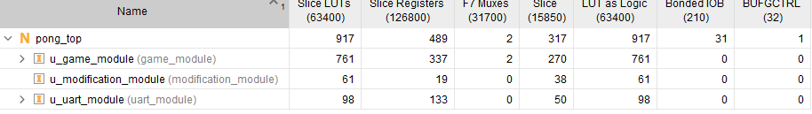
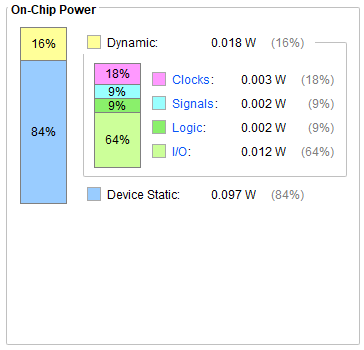

# Verification & Analysis — VHDL Pong

Structural verification (schematics), simulation results, and post-implementation resource/power analysis for the project.
For the source itself, see the [Source Code Breakdown](./source_code.md).

## Structural Verification — Schematics

Used during development to trace signal connectivity between modules and confirm the implemented hierarchy matched the intended design.

**Top-level, collapsed** - confirms the three major modules connect correctly at the top-level ports:

---

---

**Fully expanded** - the same schematic with every module opened, used to trace individual signals end-to-end across sub-module boundaries:

---

---

**Post-synthesis schematic** - top-level view regenerated after synthesis. 
Comparing this against the two diagrams above confirmed the synthesiser preserved the intended module boundaries and port connectivity (rather than, say, silently optimising an interface away):

---

---

## Implementation — Device Floorplan

Physical placement of the design on the Artix-7 100T fabric after place & route. Each cyan cell is a utilized LUT, register, or other logic primitive, positioned in its assigned location on the die:

---

---

The used logic clusters into a small, contiguous region rather than being spread across the die, consistent with the low overall utilization reported below, and gives a physical sense of how compact this design is relative to the chip's full fabric.

## Testbench & Simulation

---
The top-level design (pong_top) is verified with a self-checking testbench: [pong_top_tb.vhd](./Pong_Game/Pong_Game.srcs/sim_1/new/pong_top_tb.vhd).
---

It instantiates the full design as the unit under test, generates a 100 MHz clock, and drives reset before running a UART verification test:

- A pair of procedures (uart_recv_byte, uart_recv_word) bit-bang the UART receive line at the baud rate of the design, sampling each bit at the centre of its period; acting as the "host PC" side of the link.
- The test reads back all 25 title-screen packets sent by the design over UART and compares each one against the expected message array.
- On a mismatch, the testbench reports the specific packet and byte index along with expected vs. received values in hex, making failures easy to trace back to a specific byte rather than just a pass/fail flag.

**Behavioural (pre-synthesis) simulation** - RTL model run against the testbench above:

---

---

**Post-synthesis (functional) simulation** - the same testbench re-run against the synthesised netlist:

---

---

Both runs produced identical waveforms and both passed the title-screen byte-comparison test, confirming that synthesis preserved the functional behaviour of the design; nothing was lost or altered in mapping the RTL to gate-level logic.

## Implementation Reports

### Resource Utilization

---

---

Post-implementation, the design uses **917 Slice LUTs** and **489 Slice Registers** out of 63,400 and 126,800 available on the Artix-7 100T respectively; roughly **1.4% LUT** and **0.4% register** utilization. 
The game_module accounts for the large majority of this (761 LUTs, 337 registers), which is expected given it contains the core game logic, FSM, and display/message formatting sub-modules. The uart_module and modification_module are comparatively lightweight (98 and 61 LUTs respectively). 
This low overall utilization leaves substantial headroom on the chip; reflected in the future improvements noted in the main README around making fuller use of the available compute.

### Power Consumption

---

---

Estimated on-chip power draw is **0.115 W total**, split between **0.018 W (16%) dynamic** power and **0.097 W (84%) device static** power. 
The dynamic share breaks down further into clocking (18%), signal switching (9%), logic (9%), and I/O (64%); I/O dominates the dynamic figure, which lines up with the design's continuous use of the 7-segment display, RGB LEDs, and UART interface. 
The static power being the larger overall contributor is typical for a design running well under the FPGA's total capacity, since static (leakage) power is largely a function of the chip itself rather than the logic implemented on it.

---
[← Back to project README](./README.md)
