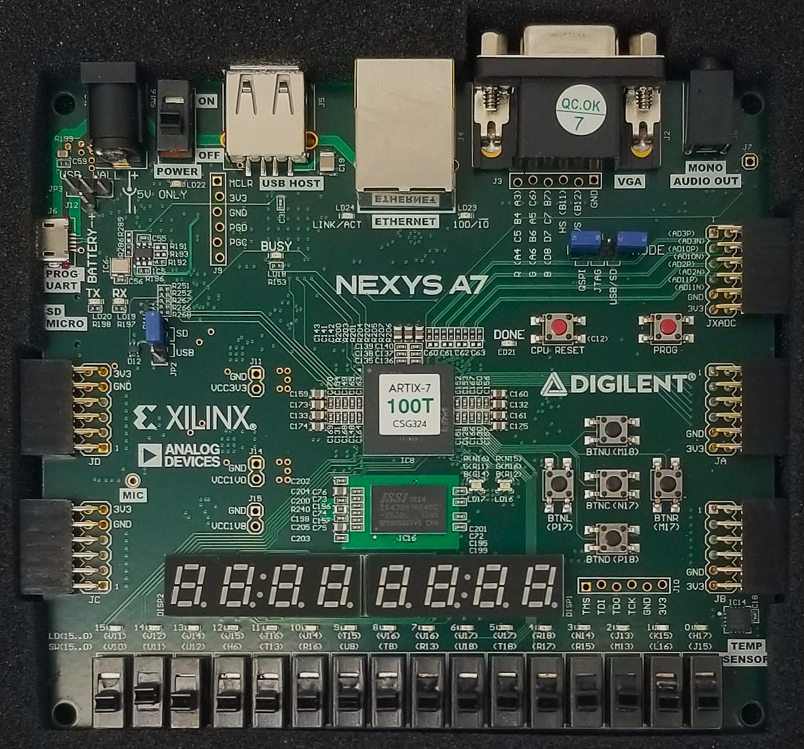

# VHDL Pong Game - FPGA Project

The aim of this course was to become gain understanding in configurable logic and flow control of **Field Programable Gate Array** technology.
In this case an AMD/Xilinx **Artix-7** chip was avalible in the **Nexys A7-100T** FPGA board package.

---

---

This chip had far more compute than was ever going to be needed in this project; featuring a huge 99,000 logic cells or 15,850 logic slices.
These logic slices contain 4 6-input **Look Up Tables** of preconfigured/routed logic, and also 8 flip-flops for sequential logic. 
Two of these slices then make up the **Configurable Logic Blocks** that are arranged in a grid like structure seperated by the sea of interconnects.
This is what an FPGA is. 
Use of these reconfigurable LUTs allow for functional malleability, and then the seperate block like structure allows for natural concurrency.
This project involved only simple applications of this increadible functional ability.
This did however, involve hands-on experience with **VHDL** as our "favourite" STRONGLY typed **Hardware Description Language** and the use of the **Vivado** toolchain. 
This was a tough learning experiance but I personally am quite proud of the results and did enjoy myself in the progress I made in learning the skills I have.
There was also plenty of learning about the real-world applications of this technology, which then culminated in a creative implementation of the classic Pong game shown here in this Project.

## Resources

- [Game README](./Game.md)                              - controls, game states, and full gameplay instructions
- [Verification & Analysis](./Design_verification.md)   - schematics, simulation, and post-implementation resource/power analysis
- [Source Code Breakdown](./source_code.md)             - direct navigation to every VHDL source file aswell as brief individual descriptions

## Features

- Full-duplex UART transceiver implemented from scratch (no vendor IP core); independent receive and transmit FSMs, with a two-stage synchroniser guarding the asynchronous receive line against metastability
- Real-time two-player "game engine": ball physics, a four-pattern serve rotation, and paddle/wall collision detection, all running synchronously off a single 100 MHz clock
- Differential terminal rendering; the display logic tracks and re-draws only the ball/paddle cells that move each frame (rather than redrawing the whole screen), keeping UART bandwidth per frame low
- On-board runtime configuration: ball speed and paddle size are adjustable live via a dedicated modification menu (Moore FSM), controlled by debounced board input buttons
- Full board I/O integration: 7-segment score/parameter display, dual RGB status LEDs, and five of the previously meationed board input buttons
- ANSI escape-sequence encoding to control cursor position and screen clearing over a standard serial terminal, with all screen text pre-built as constant byte arrays

## Architecture General Description

The firmware is structured as a layered, modular application:

- Top level             - instantiates and wires together the UART, modification, and game modules, mapping board I/O to internal signals
- UART module           - independent receive and transmit sub-modules behind a single wrapper interface
- Modification module   - owns runtime-adjustable parameters (ball speed, paddle size) and the FSM for editing them
- Game module           - coordinates gameplay mechanics, message/render preparation, and local display output as three independently testable sub-modules
- Shared packages       - common constants and types (UART timing, screen geometry, game constants) used across modules, avoiding duplication and keeping values consistent

## Skills Demonstrated

- Custom UART protocol design at the bit level (RX + TX), including baud-rate timing and safe synchronisation of an asynchronous input
- Moore FSM decomposition across multiple cooperating state machines: game flow, parameter modification, UART RX/TX, and screen rendering; each scoped to a single concern
- Timing-critical logic: deriving variable real-time behaviour (adjustable ball speed) from a fixed clock via runtime-computed counter thresholds
- Use of VHDL procedures and functions for reuse and readability; shared serve/reset routines, ANSI command-building functions, binary-to-ASCII conversion
- Debounce / single-pulse edge detection for reliable button input handling
- Structured, hierarchical design with clearly-defined entity interfaces and shared constants/types via packages, improving portability and reducing duplication
- Practical use of the Vivado toolchain: synthesis, implementation, resource/power analysis, and pre- and post-synthesis functional simulation

## Reflections & Future Direction

This project, and the course it was part of, demystified computer logic down to the individual MOSFET level (CMOS and its implementation) for me. 
Building on this, future goals of mine include deepening my understanding of **Application Specific Integrated Circuits** (ASICs) and embedded systems by designing my own CPU on an FPGA chip, and making fuller use of available hardware resources; this project again only lightly touches the total available compute of this chip.

A few smaller optimisations are flagged directly in the source for future revisits; for example, the current binary-to-ASCII conversion in the score/parameter display uses straightforward division rather than a hardware-efficient double dabble (shift-add-3) implementation, which would trade a small amount of added complexity for reduced LUT usage. 
I really truely enjoyed this course and this project. Even with the time we had to do this I still felt it was cut too short.
This made me feel like I could finally start to speak the language of the computer; the logic, binary/hex/ASCII, LATCHES, they all make solid sense. 
Writing out a logical expression in the form of CMOS with the individual P and N Channel MOSFETs has no competition. 

---
*Developed as part of a university project.*
